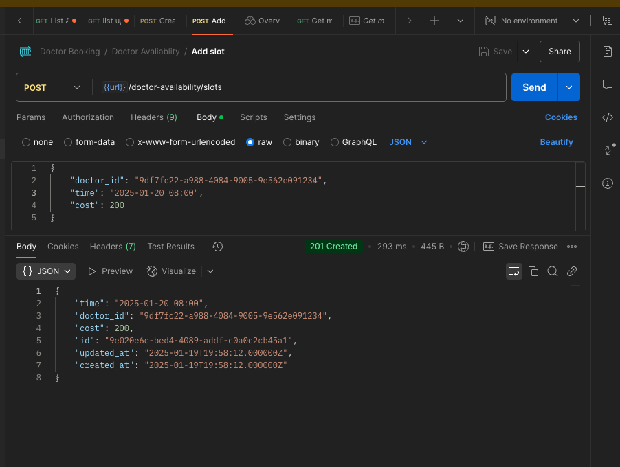
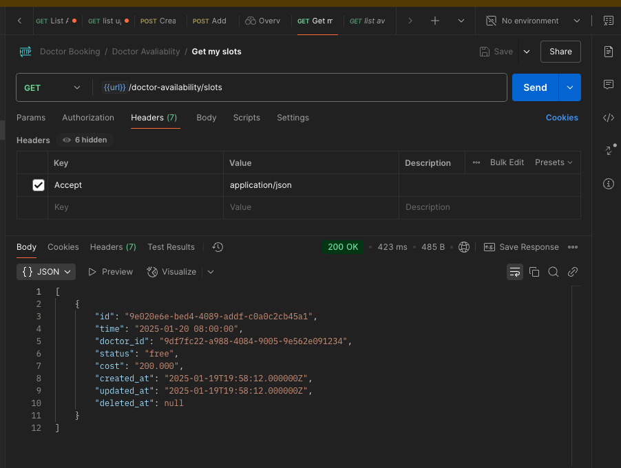
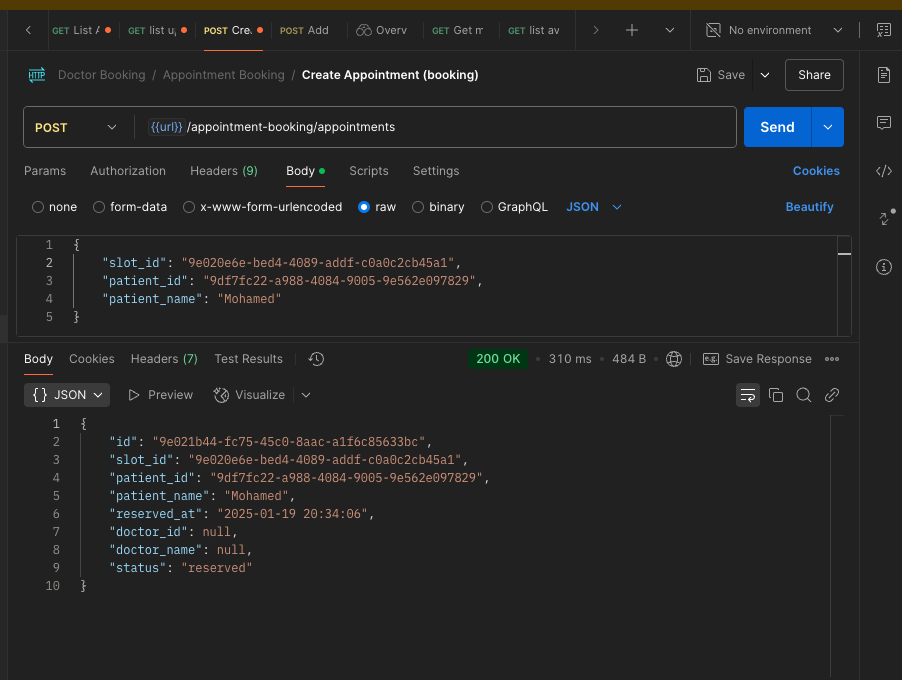
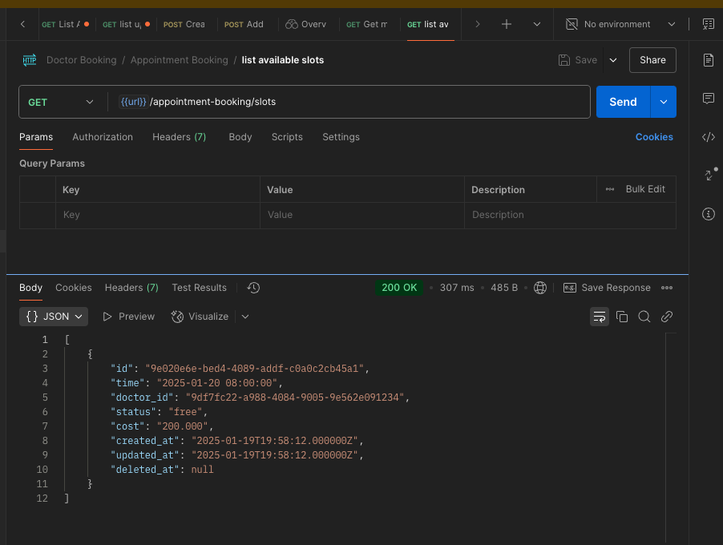
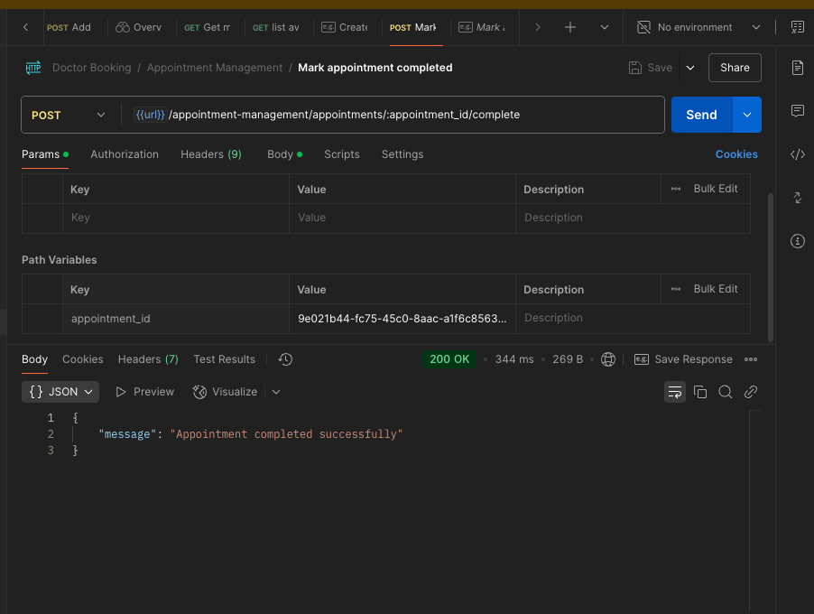
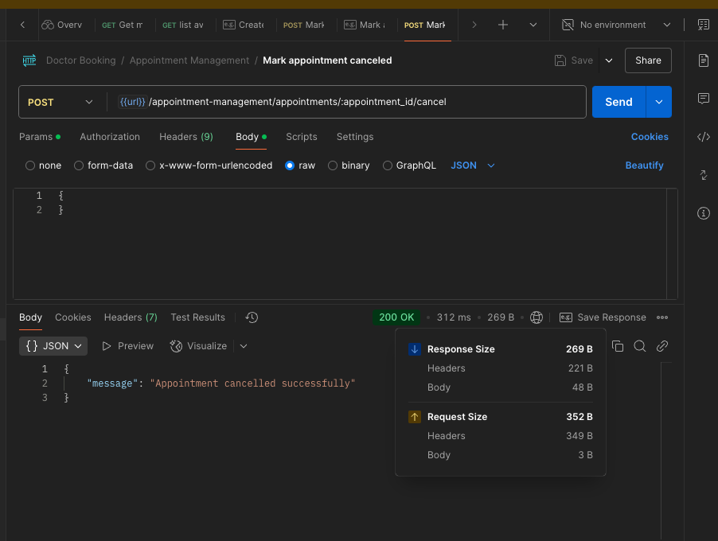

# Modular Monolith Assessment

## Installation and Setup with Docker

1. Clone the repository

```bash
git clone git@github.com:skrskr/Modular-Monolith-Assessment.git
cd Modular-Monolith-Assessment
```

2. Create environment file and update it with your settings
```bash
cp .env.example .env
```

3. Build and run the Docker containers using Docker Compose

```bash
docker compose up
```

4. Seeding doctor and patient data on database

```bash
# doctor
docker compose exec app php artisan db:seed --class="Modules\DoctorAvailability\Database\Seeders\DoctorSeeder"
#patient
docker compose exec app php artisan db:seed --class="Modules\AppointmentBooking\Infrastructure\Database\Seeders\PatientSeeder"
```

5. Access the application

Once the containers are up and running, you can access the application by opening your web browser and navigating to `http://localhost:8000`.

6. Running apis through using postman collection `./docs/postman/Doctor Booking.postman_collection.json`

    6.1 Add new slot api 
    

    6.2 List my slots api
    

    6.3 Create appointment api
    

    6.4 List available slots api 
    

    6.5 List upcoming appointments api
    

    6.6 Mark appointment as completed api
    
    
    6.7 Mark appointment as canceled api
    
